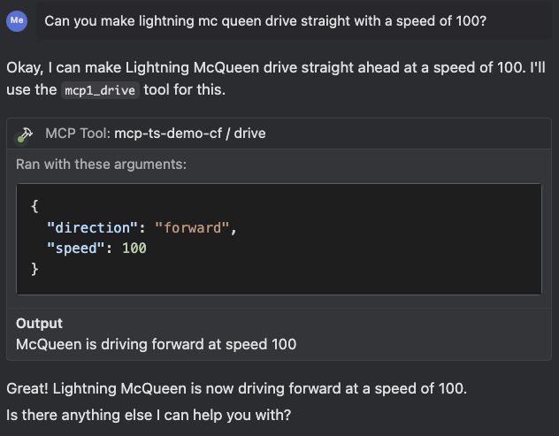

# Building a Remote MCP Server on Cloudflare (Without Auth)

This example allows you to deploy a remote MCP server that doesn't require authentication on Cloudflare Workers.

## Get started:

[](https://deploy.workers.cloudflare.com/?url=https://github.com/cloudflare/ai/tree/main/demos/remote-mcp-authless)

This will deploy your MCP server to a URL like: `remote-mcp-server-authless.<your-account>.workers.dev/sse`

Alternatively, you can use the command line below to get the remote MCP Server created on your local machine:

```bash
npm create cloudflare@latest -- my-mcp-server --template=cloudflare/ai/demos/remote-mcp-authless
```

## Customizing your MCP Server

To add your own [tools](https://developers.cloudflare.com/agents/model-context-protocol/tools/) to the MCP server, define each tool inside the `init()` method of `src/index.ts` using `this.server.tool(...)`.

## Connect to Cloudflare AI Playground

You can connect to your MCP server from the Cloudflare AI Playground, which is a remote MCP client:

1. Go to https://playground.ai.cloudflare.com/
2. Enter your deployed MCP server URL (`remote-mcp-server-authless.<your-account>.workers.dev/sse`)
3. You can now use your MCP tools directly from the playground!

## Connect your local MCP client to this remote MCP server

To use this remote MCP server with your local MCP client, add this configuration:

```json
{
  "mcpServers": {
    "mcp-ts-demo-cf": {
      "command": "npx",
      "args": [
        "-y",
        "mcp-remote",
        "https://mcp-ts-demo-cf.sibebzh.workers.dev/sse"
      ],
      "disabled": false
    }
  }
}
```

(You can also connect to this remote MCP server from local MCP clients which only support local MCP servers via stdio, by using the [mcp-remote proxy](https://www.npmjs.com/package/mcp-remote).)

## Example

If all goes well, you should see the tools become available in your local MCP client and be able to do something like this:



## Good to know

- [zod](https://github.com/colinhacks/zod?tab=readme-ov-file#introduction) is a TypeScript-first declaration and validation library.
